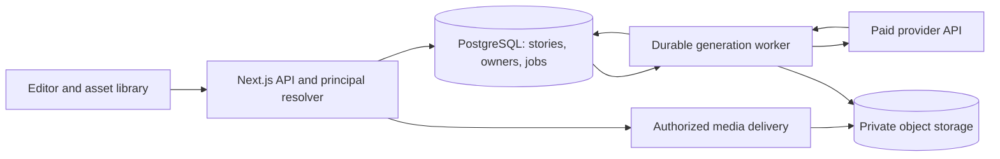

# Cloud Storage, Story Persistence, and Generation Recovery

Editor update (2026-10-07): Outline has been removed. Earlier references below
to Outline or Graph/Outline describe the previous design. The editor now uses
Graph on desktop and mobile; the passage/choice model and persistence are unchanged.
See [the current authoring decision](PROJECT_REQUIREMENTS.md#single-graph-workspace--2026-10-07).

Design date: 2026-10-06. Implementation update: 2026-10-07.

Publishing follow-up (2026-10-07): [Story publishing](STORY_PUBLISHING_DESIGN.md)
is approved for documentation, with immutable releases, stable public links,
explicit updates/withdrawal, and an author access boundary before public launch.
It extends the storage-only scope below. Publishing remains unimplemented; this
documentation does not change the current shared-owner access configuration.

## Implementation status

The first private cloud adapter is implemented. The migration was
applied to Everlove Foundation / `dextro-mvp` (`sbsmnewkilhkcaylpmue`) through the
Supabase SQL Editor. A live metadata query confirmed seven RLS-enabled tables,
two private buckets, one internal owner, and zero table grants to `anon` or
`authenticated`. The server secret is now configured in the ignored `.env.local`.
On 2026-10-07, the running application's `/api/storage` returned HTTP 200 with
`mode: supabase` and `available: true`; all seven tables were readable and both
required buckets existed with `public: false`. This verifies configuration and
read access, not a live save/upload or generation round trip. No paid provider
call or production deployment was performed in this verification.

Implemented behavior:

- Server-resolved internal identity, explicit owner filters, same-owner foreign
  keys, private media, and denied anonymous/authenticated direct table access.
- PostgreSQL story documents with reference-only assets, atomic numbered
  snapshots, asset references and revision/idempotency checks. Outline continues
  to derive from the same passage/choice graph; positions and media plans persist.
- Metadata-only library pagination, bounded media hydration with SHA-256 checks,
  signed uploads followed by server byte/format verification, and reusable saved
  media. Imports and local-game copies retain embedded backup compatibility.
- An owner/project-scoped IndexedDB pending-save outbox. Queued unsent edits can
  coalesce; prepared/in-flight mutations remain immutable. A conflict preserves
  local edits and offers a backup or an atomically staged new-story copy.
- Persistent generation intents and attempts, Workflow SDK dispatch, one claim
  per provider attempt, raw response archiving before parsing, a generated-image
  asset independent of Apply, and generated drafts saved before Keep. Repair is
  a separate second attempt. Browser Stop waiting does not cancel submitted work.
- Generation history, saved-media preview/reuse, and a browser intent key that
  reuses the same job after a lost response. Recovery never blindly repeats a
  dispatched provider call. Uncertain outcomes remain explicit.
- Embedded version-2 editable backups and standalone HTML. Playable exports omit
  provider prompts and editor-only metadata while preserving credits.

Current access decision (2026-10-07): the user requested removing the localhost
and production restrictions without adding an access gate. Cloud APIs now use
the server-configured internal owner on local and deployed hosts without sign-in
or an access code. All visitors share the same stories, media and jobs. Private
buckets and server-side owner filters remain; per-person account isolation is a
future auth integration. Removing the code gate does not verify live deployment.

Differences from the target design below:

- Workflow's local runner is development infrastructure; hosted durability and
  interruption recovery still need deployment verification. Status/history reads
  redispatch queued or stale jobs. There is no scheduled reconciliation service.
- There is no version-history/restore UI, account-login UI, automatic garbage
  collection, project storage reservation system, spend-in-dollars cap, or
  database-plus-object disaster-recovery drill yet. Originals above the editor
  limit are archived/quarantined, not automatically resized or regenerated.
- Generation history shows the latest 30 jobs. Library/media pagination currently
  uses offsets, not cursors. Local-game copying is explicit and preserves source
  IndexedDB records; deliberately clicking Copy again creates new copies.
- API routes currently submit jobs through `POST /api/generate` and
  `POST /api/media/image`, poll/list `/api/generation-jobs`, and use `DELETE` on a
  job for a stop request. Story creation is a revision-zero `PUT /api/stories/:id`;
  historical reads use `?revision=N`. Asset uploads use prepare, signed PUT and
  `/complete`. Proposed restore, trash and reconciliation APIs below are not
  implemented.

Verification: PostgreSQL-compatible migration/permission tests, replay/conflict
checks, interrupted paid-result recovery with mocked providers, graph/media/export
round trips, and IndexedDB scope tests. In-app browser checks used an isolated
fixture API: save/reopen, Outline, saved image reuse across passages, conflict
recovery in a new tab, saving a recovery copy, desktop and 390px layouts, and an
actual 3.3 MB HTML download with two embedded files. Local-file browser playback
was blocked by the browser URL policy; static checks found no external resource
references. Live Supabase connectivity and read access are verified; application
write/upload round trips, real provider jobs, and hosted execution remain
unverified. See the dated [verification record](VERIFICATION.md).

## Recommended next work

These are proposed follow-up tasks, not completed checks or authorization to
deploy or incur provider charges. Complete them in this order:

1. **Exercise the real storage path without AI charges.** Use a disposable,
   clearly labeled story and existing local image/audio fixtures. Create, edit,
   reload, and reopen it from a fresh browser session. Verify Graph/Outline,
   layout and media-plan retention, immutable revisions, asset reuse, and no
   duplicate upload for unchanged bytes. Confirm a stale save cannot overwrite a
   newer revision and that the local recovery copy survives reload. Existing
   user stories and media must remain unchanged.
2. **Verify exports from that cloud story.** Download an editable backup and HTML
   using the UI. Reimport the backup and compare the graph and media. Open the
   downloaded HTML manually with network access disabled if the test browser
   cannot open local files. Follow choices to endings, check images/music and
   restart, and confirm no login, Supabase access, or signed URL is required.
3. **Verify durable generation before expanding usage.** First use controlled
   provider fixtures against real persistence to exercise submission, interrupted
   result saving, browser closure, recovery, and duplicate requests. Then run a
   small, explicitly budgeted real story/image trial. Confirm one provider attempt
   per claimed request, raw output retention, independent image retention before
   Apply, saved drafts before Keep, and honest uncertain outcomes. Do not claim
   that every paid response is recoverable if receipt or archiving fails.
4. **Verify the deployed shared workspace.** Keep the user-account UI deferred
   and use the requested shared-owner access without adding a sign-in gate.
   Configure the cloud environment variables and redeploy; check storage,
   generation and export on the deployment URL. Verify Node.js 22+, hosted
   Workflow execution/recovery, limits and monitoring, plus a backup/restore
   procedure for both database and object storage.
5. **Add operational controls, then accounts when needed.** Prioritize automatic
   stale-job reconciliation, actionable failure reporting, storage/usage
   visibility, and revision restore. For multiple independent users, replace the
   internal principal with verified sessions and test two-user isolation across
   stories, assets, signed uploads and job status. Retention and garbage collection
   need an explicit policy before enabling destructive cleanup.

The sections below retain the target architecture and rollout requirements;
they are not a claim that every proposed feature is delivered.

## 1. Decision and scope

Use PostgreSQL for owned records, story documents, revisions, and generation jobs;
use private object storage for image/audio bytes. Recommend Supabase Postgres and
Storage for the first deployment, alongside the existing Vercel application.
Supabase Auth can supply verified identities later without changing asset or story
ownership. The Supabase project now exists; see the implementation status above.

The immediate requirement is private internal testing without building account
registration, login screens, billing, or public publishing. Nevertheless, every
private record must have a stable owner, and every received generation result
must be saved independently of whether the author applies or keeps it.

The first storage release includes durable generation dispatch and recovery.
Saving only after Apply, or adding cloud uploads to the current browser-bound
request, would leave the main paid-result loss problem unresolved.

## 2. Pre-implementation baseline and gaps

| Current source | Observed behavior | Required change |
| --- | --- | --- |
| `src/storage/story-repository.ts` | IndexedDB holds story metadata and media Blobs; no cloud repository. | Make the server the durable authority; retain IndexedDB as a local cache/outbox. |
| `src/server/media/image.ts` | Returns an embedded image to the browser; duplicate/concurrency guards live in one process. | Archive output before reporting success; use persistent jobs and cross-instance limits. |
| `src/modules/media/generation/image-generation.tsx` | Candidate exists in component state; Discard removes that state. | Candidates point to saved assets. Dismissing a candidate never deletes the underlying asset. |
| `src/server/generation/story.ts` | Returns a validated draft without saving; a structural repair can make a second paid call. | Save generated drafts and track each provider call, including repair. |
| `src/modules/generation/draft-provider.tsx` | Reload clears the unaccepted draft. | Load recoverable drafts and unfinished jobs from the server. |
| `src/modules/editor/outline/model.ts` | `outlineFor(story)` derives a finite view of passages, choices, convergence, and loops. | Persist the underlying graph once; continue deriving Outline. |
| `src/server/auth/origin.ts` | Checks request origin, not the visitor's identity. | Add a server identity boundary before any owned-record access. |

These observations describe the browser-local baseline before the cloud adapter.
The implementation status above identifies which gaps have been addressed.

## 3. Identity now and later

### Internal testing

Create one `app_users` record of kind `internal`, with a random UUID and no linked
login. Configure its ID on the server as `INTERNAL_TEST_OWNER_ID`. A single
`requirePrincipal()` function resolves this owner whenever `STORAGE_MODE=supabase`,
including production. The current user-approved test setup adds no sign-in,
access-code or hostname gate. The earlier deployment-protection prerequisite is
superseded by this decision. Account mode and verified session ownership remain
future work.

This creates **one shared internal workspace**, not separate identities for every
tester. If testers need isolation from one another, verified per-tester identity
is required at that point. A browser-generated UUID, a user ID in a request body,
an unguessable story ID, and the Origin header are not identity proof.

### Account support later

`app_users.id` is the application owner ID. `app_users.auth_user_id` is a nullable,
unique link to a verified Supabase Auth user. The principal resolver verifies the
session and resolves that link; the client cannot choose or reassign it.
An administrator can link the internal owner's existing record to its rightful
account, preserving asset paths and foreign keys. Shared test data must be
explicitly assigned or kept as an internal workspace, never claimed by the first
person who registers.

No email, password, profile editor, or public user directory is needed now.

### Authorization rules

- All browser reads/writes go through owner-aware application APIs. Ignore or
  reject client-supplied `owner_id`, `user_id`, storage paths, and billing totals.
- Get, list, update, delete, revision restore, export, job status, asset reuse, and
  media delivery all use the server-resolved owner. A wrong-owner ID returns 404.
- Enable RLS and deny anonymous database access from the first migration. During
  internal testing, server-only service access uses a repository that requires a
  principal and includes the owner in every predicate. This is a trusted-server
  boundary: the service role bypasses RLS; RLS does not fix a missing server check.
- Before account access is enabled, ordinary reads use the verified user's token
  and RLS. Policies resolve `auth.uid()` through `app_users.auth_user_id` and check
  ownership. Internal workers retain a narrowly exposed server-only write path.
  Ordinary writes remain owner-checked server transactions; direct client writes
  to base tables are denied. RLS is a read backstop in this arrangement, not a
  claim that privileged server writes are automatically owner-scoped.
- Set grants as well as policies. Users cannot write identity mappings, job
  execution states, generation provenance, usage, or storage locations. Update
  policies require both existing-row and new-row ownership checks. Service-only
  functions must not be executable by anonymous or ordinary authenticated roles.
- Keep mutations' same-origin checks. Scope local caches by environment and owner;
  clear mounted private data and cached media on account change/sign-out.

These RLS/service-role properties are documented in the
[Supabase RLS guide](https://supabase.com/docs/guides/database/postgres/row-level-security).

## 4. Storage boundaries



Use separate test and production projects/buckets and credentials. Do not store
generated files in the repository, `public/`, deployment-local disk, process
memory, or only the browser. Temporary worker memory is transport, not recovery
storage.

Use a private `user-media` bucket with immutable, server-generated paths:

```text
owners/{owner_id}/assets/{asset_id}/original.webp
owners/{owner_id}/assets/{asset_id}/display.webp
owners/{owner_id}/assets/{asset_id}/thumbnail.webp
```

Persist the bucket and object key, never a public URL, expiring signed URL, or
base64 file in story JSON. Asset IDs are globally unique UUIDs. The owner path
helps organization; authorization is still enforced separately.

For the first release, serve bytes through `/api/assets/:id/content` after an
owner check, using private/no-store application responses and streaming audio
ranges as needed. Do not let a shared image optimizer/cache turn this route into
a public image endpoint. This supports the requirement that each request checks
the current user's access. A later signed-URL optimization may issue short-lived
URLs after authorization, but possession of an unexpired URL grants access;
it is not a second identity check. Supabase supports private authenticated
downloads and time-limited signed URLs, whereas public buckets allow URL holders
to read files. See [Storage access models](https://supabase.com/docs/guides/storage/buckets/fundamentals).

Intentionally public CC0 audio lives in the separate `music-library` bucket,
with active metadata in `music_library_tracks`. When copied
into a private story, keep its catalog ID, author, source URL, and license. Do not
make generated user images public to reuse the catalog delivery mechanism.

## 5. Logical database schema

All application IDs below are UUIDs unless noted. Owner IDs are non-null foreign
keys to `app_users.id`; times use `timestamptz` set by the server. This is a logical
schema, not a SQL migration ready to execute.

| Table | Important columns | Responsibility |
| --- | --- | --- |
| `app_users` | `id`, `kind` (`internal` / `account`), `auth_user_id` nullable unique, `created_at` | Stable ownership independent of account UI. |
| `stories` | `id`, `owner_id`, `title`, `description`, `genre`, `status`, `schema_version`, `revision`, `document jsonb`, `created_at`, `updated_at`, `deleted_at` | Current editable story. Status: `draft`, `ready`, or `archived`; deletion is separate. |
| `story_versions` | `id`, `owner_id`, `story_id`, `revision`, `snapshot jsonb`, `reason`, `mutation_id`, `mutation_hash`, `import_id` nullable, `import_checksum` nullable, `creation_key` nullable, `generation_job_id` nullable, `created_at` | Immutable saved revisions, including original generated drafts. Snapshot contains title, description, genre, schema version, and document. Mutation/import/creation keys support retry recovery. |
| `media_assets` | `id`, `owner_id`, `kind`, `source`, `state`, `name`, `credit`, `bucket`, `object_key`, `mime_type`, `byte_size`, `width`, `height`, `sha256`, `display_key`, `thumbnail_key`, `provenance jsonb`, `generation_attempt_id` nullable, `output_index`, `created_at`, `updated_at`, `deleted_at` | Independent asset library; state is `pending`, `ready`, `quarantined`, or `failed`. Original bytes are immutable. |
| `story_asset_refs` | `owner_id`, `story_id`, `revision`, `asset_id` | Server-derived asset references for each saved revision, including unused assets kept in that story's library. Used for ownership integrity and safe deletion. |
| `generation_jobs` | `id`, `owner_id`, `kind` (`story` / `image`), `story_id` nullable, `source_revision` nullable, `target jsonb`, `idempotency_key`, `request_hash`, `input jsonb`, `prompt_version`, `status`, `result_story_id`, `result_revision`, `error_code`, `cancel_requested_at`, `dispatch_id`, timestamps | Durable user operation, immutable inputs, recoverable result identity, and dispatch record. |
| `generation_attempts` | `id`, `owner_id`, `job_id`, `sequence`, `purpose` (`initial` / `repair`), `status`, `provider`, `model`, `provider_request_id`, `provider_response_id`, `request jsonb`, `result_json jsonb`, `output_key`, `usage jsonb`, `charge_state`, `reserved_cost`, `estimated_cost`, `billed_cost`, `currency`, `price_version`, `lease_token`, `lease_expires_at`, `dispatched_at`, timestamps | One record per actual provider call. Records raw text/results, repair costs, uncertain outcomes, and worker claims. Binary output is stored in object storage. |

`billed_cost` remains null unless verified against provider billing. A successful
response, estimated price, and actual invoice charge are different facts.
File metadata may be null while pending; ready assets require verified original
object metadata. Store MIME type, size, and checksum for display derivatives too,
so editor-size validation does not accidentally use the original's size.

### Keys, indexes, and integrity

- Unique `(owner_id, kind, idempotency_key)` on jobs. Retain the durable key/result
  mapping; do not expire it after the current ten-minute process-local window.
- Unique `(job_id, sequence)` on attempts and `(generation_attempt_id, output_index)`
  for generated assets. One paid result has one stable asset identity even if the
  worker or UI processes its completion twice.
- Unique `(story_id, revision)` on versions. Primary key
  `(story_id, revision, asset_id)` on references. Include owner-qualified unique
  keys on referenced tables and composite foreign keys for story/version/asset/
  job/attempt relationships so rows cannot combine owners.
- Unique `(story_id, mutation_id)` for edits and owner-qualified non-null import/
  creation keys on initial versions prevent duplicate imports or blank stories
  when the response to creation is lost. Use a client-generated creation key for
  each deliberate new story; retries reuse it.
- Index stories and assets by `(owner_id, updated_at/created_at DESC, id)`, with
  active-row filters where useful. Use cursor pagination; do not download all
  stories and media just to display a library. Index jobs by `(status, created_at)`
  for dispatch/recovery and `(owner_id, created_at DESC, id)` for history.
- Index references by `asset_id`; use `(owner_id, sha256)` only as a non-unique
  lookup for upload reuse. Do not merge generated result records across paid
  attempts or expose cross-user content deduplication.
- The server validates every document reference and writes `story_asset_refs` in
  the same transaction as the revision. Clients cannot update that index directly.
  A referenced asset must belong to the same owner and be ready, not deleted.
- Archive/soft-delete by default. Do not cascade a story deletion into asset or
  generation deletion. Preserve jobs/versions needed for recovery and accounting.

There is no need for separate SQL tables for every passage and choice in this
increment. The existing cap is 150 passages, and authoring saves the whole story.
Relational ownership/query fields plus a JSONB document fit that workflow.
PostgreSQL supports structured JSONB storage and indexing; this design uses
normal owner/list indexes first, adding JSON indexes only for real queries.
See [PostgreSQL JSON types](https://www.postgresql.org/docs/current/datatype-json.html).

## 6. Story and Outline representation

`stories.document` holds `startId`, ordered passages, ordered choices, asset
references, `mediaPlan`, and Graph layout. Row fields hold the title, description,
genre, owner, ID, revision, and timestamps; do not maintain competing copies of
those fields inside the document.

Example of the proposed cloud document (illustrative IDs abbreviated):

```json
{
  "startId": "arrival",
  "passages": [
    {
      "id": "arrival",
      "title": "The harbor",
      "text": "Two paths leave the silent harbor.",
      "ending": false,
      "media": { "imageId": "asset-uuid-1", "audioId": "" },
      "choices": [
        { "id": "follow-light", "text": "Follow the light", "target": "lighthouse" },
        { "id": "return-home", "text": "Return home", "target": "home" }
      ]
    },
    {
      "id": "lighthouse",
      "title": "A new keeper",
      "text": "You light the beacon and stay until dawn.",
      "ending": true,
      "media": { "imageId": "asset-uuid-1", "audioId": "" },
      "choices": []
    },
    {
      "id": "home",
      "title": "Home again",
      "text": "The harbor lights fade behind you.",
      "ending": true,
      "media": { "imageId": "", "audioId": "" },
      "choices": []
    }
  ],
  "assets": [
    { "id": "asset-uuid-1", "name": "Harbor at dusk", "credit": "Generated with OpenAI" }
  ],
  "mediaPlan": {
    "artBrief": "Muted coastal colors and distant figures.",
    "scenes": [
      { "id": "harbor", "description": "An empty harbor at dusk.", "passageIds": ["arrival"] }
    ],
    "cues": [{ "passageId": "arrival", "mood": "mysterious" }]
  },
  "editor": {
    "positions": [
      { "id": "arrival", "x": 0, "y": 0 },
      { "id": "lighthouse", "x": -180, "y": 240 },
      { "id": "home", "x": 180, "y": 240 }
    ]
  }
}
```

The server binds validated scene revisions using the existing `bindMediaPlan`
logic when generating/importing a plan. On normal editing saves, preserve the
original scene fingerprint: recomputing it would incorrectly bless a stale plan.
The fingerprint is a stale-content check, never an authorization boundary.

This is a proposed `StoredStoryV3` representation with row `schema_version = 3`;
it is not accepted by the existing version 2 `Story` schema, which requires
embedded `asset.data`. The separate number `revision` counts saves (1, 2, 3...).
Do not use one number for both content-format migration and edit concurrency.

Asset kind, bytes, provenance, and location come from `media_assets`. Snapshot
name/credit fields preserve story-specific display information at that revision;
they cannot overwrite authoritative provider provenance. Multiple passages or
stories belonging to the same owner can reference one asset without uploading
it again.

Graph edges are the `choices[].target` links. Outline is produced by traversing
from `startId`, preserving choice order and including disconnected passages.
Convergence and loops remain links to existing IDs, not duplicated nested nodes.
Save passage/choice order and Graph positions; keep expanded Outline rows,
selection, playhead, and zoom/viewport in per-user local view preferences for now.
Legacy backup viewport values can seed those preferences on import.

If a separate AI planning outline (acts, beats, summaries) is introduced later,
add a versioned `planning` section with stable beat IDs and explicit passage ID
links. It would be planning data, not a second editable copy of the current
Graph/Outline. No such separate outline exists in the current model.

### Saves, drafts, and concurrent tabs

1. Save a valid generated story as `status = draft` and revision 1 **before** its
   generation job becomes successful. Review can reload it after the tab closes.
2. Keep & edit promotes the same story to `ready`; it does not make a duplicate.
   Dismissing a generated draft archives it. Invalid provider output is retained
   privately on the attempt, never treated as a playable saved story.
3. Autosave coalesces edits for approximately one second and keeps a durable local
   outbox entry. A content save sends `baseRevision` and an idempotent `mutationId`.
   Store a unique `(story_id, mutation_id)` plus payload hash on the saved version
   for retry lookup; identical replay returns its prior committed revision, while
   changed content under the same mutation ID is rejected.
4. A transaction checks ownership and schema, locks the current row, compares
   `baseRevision`, writes the new current story, inserts an immutable version, and
   records its asset references. All succeed or all roll back. A stale revision
   returns 409; retain the local draft and let the author reload or save a copy.
5. Local queued state is not a successful server save. Use separate pending,
   saved, offline, and failed indicators. Undo remains the existing local session
   operation; a server revision restore creates a new current revision.

Validate schema, unique IDs, size bounds, and owned asset references on every
save. Continue allowing incomplete manual drafts with validation issues; require
playable graph validity for playable exports, and the stricter generation rules
for AI-produced drafts. Do not make an unfinished paragraph impossible to save.
Initially retain all server content revisions; do not snapshot every keystroke or
viewport movement. Establish a retention policy before enabling revision pruning.

## 7. Durable paid-generation flow

```text
Receive intent and stable idempotency key
  -> authorize, validate, check admission limits, commit queued job
  -> durable dispatcher claims job
  -> reserve quota, record provider attempt and dispatch boundary
  -> call provider
  -> persist received output
  -> validate / prepare display version
  -> commit asset or draft result
  -> report success; browser reloads saved result
```

The API returns `202 { jobId }` after committing the job. The browser polls the
owned job, and can discover it again from history after losing the response.
The browser persists one idempotency key per user intent before submission.
Repeated clicks and network retries reuse that key and payload; a deliberate
new variation gets a new key. The server hashes normalized inputs, resolved model,
prompt-template version, style, dimensions, and source revision. Reusing a key
with different input returns 409 rather than silently generating something else.
For an existing key, compare using that job's originally pinned defaults and
template version; a deployment or changed default model must not turn a retry
into a new intent. Resolve fresh defaults only when creating a new job.

Use Vercel Workflows as the initial durable-runner candidate, subject to a small
deployment validation. Its persistence/retry facilities suit resumable work;
they do **not** establish exactly-once billing at an external provider.
See [Vercel Workflows](https://vercel.com/docs/workflows).

The database job row doubles as a dispatch outbox: a recovery dispatcher finds
committed queued jobs that never received a workflow ID and submits them again.
Workers atomically claim jobs with a lease/fencing token; duplicate workflow
delivery cannot start another provider attempt. Expired claims before dispatch
can be resumed. An attempt marked dispatched without a persisted result goes to
reconciliation/`outcome_unknown`, not automatically back to the paid call.
Use authenticated worker/scheduler invocation; never expose a public dispatch
endpoint or an in-process promise as the only execution mechanism.

Persist request parameters and attempt intent before sending, then capture
provider request/response IDs and usage where returned. One structural story
repair remains the maximum; it gets sequence 2, a separate quota reservation,
and its own raw output. Redelivery must not consume another repair attempt.

For images, insert a pending asset with its attempt ID and output key before
dispatch. Once output
arrives, durably store the original before handing it to the browser. Verify file
type, checksum, and size; create a display derivative when needed. The editor's
current 2 MB image limit is not a reason to silently throw away a paid original:
retain it, and compress a display copy or show that it cannot currently be
applied. Configure a documented bounded provider-response/archive limit, with
explicit errors for oversized or malformed responses; do not allow unbounded
payloads. Quarantined bytes are never rendered as ordinary media.

For stories, persist bounded raw text and validation results before repair; create
the successful draft, initial version, and job-result linkage in one transaction.
Persist text before generating scene images. Each of up to four scenes gets its
own image job, keyed to the draft, saved source revision, and stable scene ID.
Partial image failures never discard the saved story or completed scenes.

### Job states and failure handling

Normal states are `queued -> running -> persisting -> succeeded`. Alternative
states are `failed`, `cancelled` (before dispatch), and `outcome_unknown`. Attempt
state distinguishes claimed, dispatched, received, persisted, and uncertain work.

| Event | Required behavior |
| --- | --- |
| Double click, browser retry, duplicate queue delivery | Return the existing owned job/result; no additional paid call. |
| Browser closes or stops waiting | Worker continues; output appears in draft/asset/job history. Client disconnect does not abort durable work. |
| Cancel before provider dispatch | Atomically cancel and release the unused reservation. |
| Cancel after provider dispatch | Record cancel request, stop later scene/repair calls, preserve any arriving output. Do not promise a refund. |
| Provider timeout, connection loss, or worker death after dispatch | Mark `outcome_unknown`, keep the possible charge/reservation, and avoid automatic regeneration. |
| Original upload fails while bytes remain available | Retry storing those same bytes; do not call the provider again. |
| Object uploaded, database completion fails | Reconcile the deterministic object key/checksum into the original asset/job; do not regenerate. |
| Worker dies after durable output, before acknowledgment | Resume from persisted text/object; finalize idempotently. |
| Passage edited/deleted while generation runs | Keep the asset in the library; require current-target/revision validation before applying it. |
| Discard preview, replace image, undo, or delete story | Change assignment or visibility only; retain the generated original. |

Database transactions cannot atomically include a provider call and object
storage. There is an unavoidable failure window if the provider charges but its
response is lost before any durable copy exists. Recovery may use a provider
retrieve operation only when that adapter's support and retention are verified.
Do not assume the current image API has retrievable jobs or honors idempotency
headers. Without that capability, mark the result unrecoverable/uncertain and
require an explicit new paid intent. Never claim guaranteed recovery of every
charged request or exactly-once external billing.

Late worker responses may archive bytes under the original attempt's immutable
identity; stale lease holders cannot overwrite newer job state or current story
content. A reconciler can complete a verified late result. Existing object writes
must compare hashes rather than overwrite a different object at the same key.

### Cost controls

Keep global and per-owner concurrency/daily limits in durable database logic.
Atomically reserve estimated cost or bounded request allowances before each
provider attempt using consistent owner/global locking; include outstanding and
uncertain attempts in the budget. Block new paid work when reservation or storage
availability checks fail. Exclude failed-before-dispatch work from consumed quota.
Set concrete limits when configuring the test environment, not by inventing model
prices here. Store usage and dated price inputs for reconciliation; preserve an
unknown charge state when the response does not prove a billing outcome.

Reusing an existing image is always available without a new provider call. A
matching prompt alone is not an idempotency key: intentional variations must
still be possible. Storage/upload retries and display conversion do not consume
generation quota.

## 8. Retention, deletion, and backup

- Keep received generated originals, unselected candidates, and generated story
  drafts by default during internal testing. Discard means not applied, not erased.
- Soft-delete a story without removing shared assets or generation history.
  Removing unused assets from one story only removes its current associations;
  historical revisions still retain their references.
- Asset trash is reversible. Permanent purge is a separate explicit action after
  a grace period and a transactional reference check across retained revisions.
  Do not purge assets needed for undo/restore; provide a later coordinated history
  purge if desired. Serialize reference creation and purge claims so an asset
  cannot be attached while its bytes are being removed.
- A recoverable purge job marks the asset unavailable before object deletion,
  retries deletion safely, and retains a tombstone after completion. Cleanup of
  pending uploads checks age, active leases, output manifests, and references;
  an object is not garbage merely because database finalization is delayed.
- Back up PostgreSQL and actual object bytes independently, with a manifest of
  keys/checksums and a tested restore procedure. Supabase database backups do not
  include Storage objects. See [Database backup scope](https://supabase.com/docs/guides/platform/backups).
- Proposed test policy: daily independent database/object backup, 30-day backup
  retention, and a restore rehearsal before relying on the hosted workspace.
  This gives at most a 24-hour target backup interval, not zero-loss protection.
  Provider plan/backup availability must be checked when provisioning.

Offline HTML and editable backups deliberately contain the owner's selected
content and files. They are downloadable copies and cannot enforce account
privacy after the owner shares them. Public hosted publishing remains separate
future scope.

## 9. API and module boundaries

| Proposed API | Contract |
| --- | --- |
| `POST /api/generation-jobs` | Owned, idempotent story/image intent; returns persisted job ID. |
| `GET /api/generation-jobs` and `GET /api/generation-jobs/:id` | Paginated history/status/result references for the current owner. |
| `POST /api/generation-jobs/:id/cancel` | Cancellation semantics depend on the dispatch boundary. |
| `GET/POST /api/stories` | Paginated metadata / idempotent blank or imported story creation. |
| `GET/PUT/DELETE /api/stories/:id` | Owned read / revision-checked save / soft delete. |
| `GET /api/stories/:id/versions` | Owned revision history. |
| `POST /api/stories/:id/restore` | Restore an owned version as a new revision with a base-revision check. |
| `GET /api/assets` | Paginated private reusable asset library, including unused generated images. |
| `POST /api/assets` | Owned upload; validates bytes and allocates its own object key. |
| `GET /api/assets/:id/content` | Owner-authorized private media stream; no arbitrary URL/key input. |
| `DELETE /api/assets/:id` | Reversible trash with reference checks; no immediate object purge. |

Use repository methods for transactional draft promotion/archive, media attach,
import, and version restore. Attaching an asset is a revision-checked story save,
not permission to mutate the asset's owner. Sample content remains a bundled
public sample; editing it creates an owned copy.
Upload requests also use an owner-scoped upload key and checksum with a unique
constraint on non-null `(owner_id, upload_key)` in `media_assets`; replay resumes
the same pending upload. This supports import retries without duplicate files.

Suggested implementation locations:

- `src/server/auth/principal.ts`: shared internal test owner; verified session identity is future work.
- `src/server/storage/`: owned story/asset repositories, transactions, private
  object operations, quotas, and reconciliation.
- `src/server/generation/jobs/`: durable orchestration, attempt lifecycle, provider
  adapters, worker claims, and recovery.
- `src/storage/`: HTTP repository adapter plus owner-scoped IndexedDB cache/outbox.
- `src/modules/story/` and `src/modules/media/assets/`: explicit stored/reference
  schemas and adapters, independent of server imports.

At the first migration, a bounded hydration adapter can load authorized bytes
into today's in-memory `Story` for editor/player/export compatibility. Keep the
current size limits; do not hydrate an entire library on listing. Later, lazy
media resolution can avoid loading every file when opening one story.

## 10. Existing data migration and rollout

1. **Identity and storage foundation:** shared server-configured internal
   owner, RLS/grants, tables, private bucket, owned repositories, and restore plan.
2. **Paid-result retention:** persistent jobs/attempts, worker/outbox recovery,
   original-image archive, generated draft persistence, and asset/job history.
   These are required before describing paid generation as recoverable.
3. **Cloud editing:** revision-checked saves, local cache/outbox, shared assets,
   revision restore, library pagination, and compatible exports.
4. **Account access:** verified sessions, identity linkage, tested user-token RLS,
   owner-scoped caches, and replacement of shared internal ownership for per-user access.

For migration, the browser sends its local stories and Blobs through the owned
import API. Existing passage/choice IDs may be arbitrary strings and remain
stable. Allocate server story/asset UUIDs, remap all image/audio references, and
preserve media plans, provenance, positions, credit, and ordering. Never accept
an imported file's alleged owner or cloud object path.

Use a stable client import ID and stored source checksum per owner; record these
on the initial version with a unique `(owner_id, import_id)` mapping so retry
does not create duplicate stories. Complete all assets before committing the
story and references. Leave recoverable partial uploads associated with that
import. Compare round-trip content/asset checksums before acknowledging migration;
retain the original IndexedDB data until success is verified.

Version 1 and 2 editable files remain importable. The cloud representation uses
version 3; initially export an embedded version 2 backup through the adapter so
existing editors can read it. Never replace embedded `data` with a signed URL in
a file that still declares version 2. Offline HTML continues embedding each used
asset once after authorization and validation.

## 11. Implementation acceptance criteria

These are future implementation checks, not results established by this design.

- Generate an image, dismiss its preview, reload, and reuse it from the asset
  library without another provider call; repeat after closing the tab mid-job.
- Recover a generated story after reload before Keep, and preserve it when only
  some planned scene jobs succeed.
- Submit the same idempotency key concurrently to different server instances:
  one logical job and one initial provider attempt; altered payload returns 409.
- Simulate process death before dispatch, after dispatch, after object upload,
  and after database commit. Resume only safe steps; uncertain dispatch never
  blindly triggers a second paid call. Record a separate attempt for repair.
- Lose a save response and replay its mutation ID; recover the committed revision
  without a duplicate save. Conflicting tabs retain both sets of unsaved edits.
- Two verified owners cannot list/read/alter each other's stories, assets, jobs,
  versions, or media bytes, even with known IDs. Test forged ownership, asset
  association, identity mapping, and direct database/storage access as well.
- Verify deployment protection from an unauthenticated session on every deployed
  hostname and API entry point while fixed internal-owner mode is enabled.
- Load Graph/Outline with convergence, a cycle, disconnected nodes, positions,
  music Silence, and shared images after a server round trip. Preserve the same
  structure and editing behavior.
- Import version 1/2, restore a revision, remove/undo an assignment, and delete one
  of two stories sharing an image without losing the other's media.
- Verify quota reservations across concurrent workers and uncertain calls;
  generated files above the editor limit are archived or explicitly quarantined.
- Restore the database plus private files into an isolated environment and verify
  checksums, ownership, references, and offline exports.

Implementation verification must include the affected UI in the Codex in-app
browser, schema/ownership/recovery tests, `pnpm typecheck`, and `pnpm lint`.
Never use `pnpm build` for this repository's local verification.
